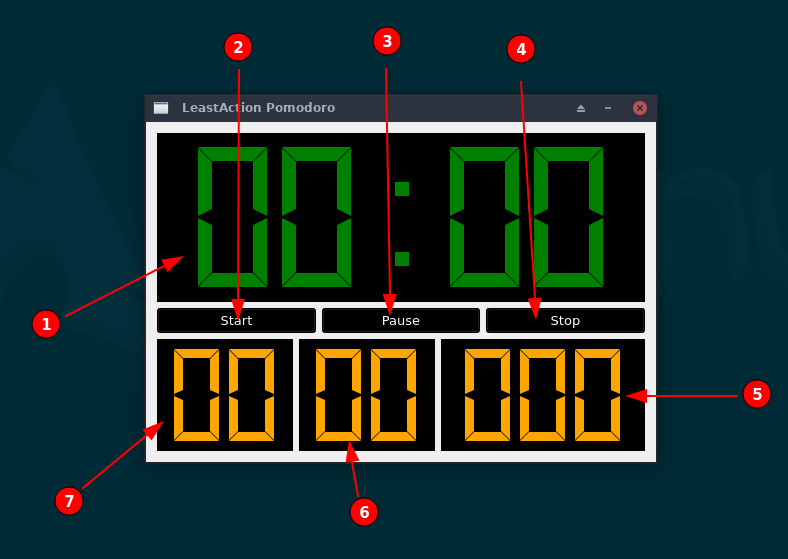

# Overview of Widgets


1. The main countdown timer. 
   * Starts at 30:00, in red color, for a ```Pomodoro```
   * Starts at 06:00, in yellow color, for a ```Short Break```
   * Starts at 60:00, in green color, for a ```Long Break```

2. Starts the countdown timer.
   * If a ```Pomodoro``` is being started, increments the Pomodoro count 
     display (7)

3. Pauses a running countdown timer, or resumes a paused countdown timer.
   The text displays either ```Pause``` or ```Resume```, depending on the
   current state of the countdown timer.
   * **Disabled for short and long breaks**

4. Stops the running countdown timer and sets the LCD display to the next
   countdown type.

5. Displays the total number of minutes worked "today". Since currently there is no
   persistence, this means total number of minutes worked since the application was
   last started. The total number of minutes is rounded off to the nearest minute.

6. Displays the number of minutes worked on the last ```Pomodoro```, rounded to
   the nearest minute.
   * **Resets to 00 only when the next ```Pomodoro``` is started**

7. Displays the total number of ```Pomodoro```s worked on "today". Since currently  
   there is no persistence, this means total number of ```Pomodoro```s worked since the application was last started. 

# Notes
1. When the ```Pomodoro``` countdown timer runs down to 00:00 but the user hasn't 
   clicked ```Stop```
   * 00:00 should start blinking, with the alarm sounding
   * (5) and (6) should continue to be updated.
   * (5) and (6) **stop updating** only when the user clicks on ```Pause``` or 
      ```Stop``` while a ```Pomodoro``` is in progress.

1. Only ```Pomodoro```s can be **paused**.

